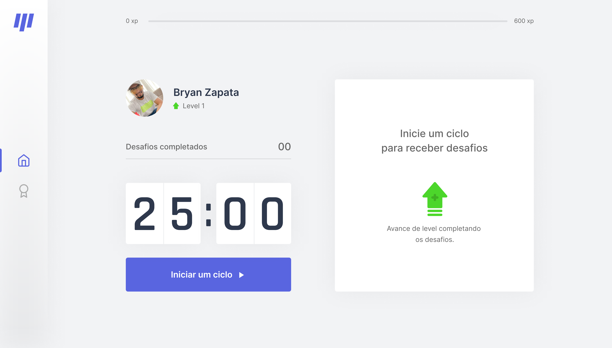

<h1 align="center">
 
  
 
 
Move.it
</h1>

this is an application to measure the hours of work and rest depending on a certain time

  

[//]: # "Add your gifs/images here:"

   
  <!--  -->

## Features

[//]: # "Add the features of your project here:"

This app features all the latest tools and practices in mobile development!

- ⚛️ **Nextjs** — A JavaScript framework ssr
- ⚛️ **React js** — A JavaScript library for building user interfaces

## Getting started

**Getting started with the frontend**

1. Move yourself to the backend folder: `cd moveit-next`
2. Run `yarn install` to install dependencies
3. Run `yarn dev` to start server

## License

This project is licensed under the MIT License - see the [LICENSE](https://opensource.org/licenses/MIT) page for details.
